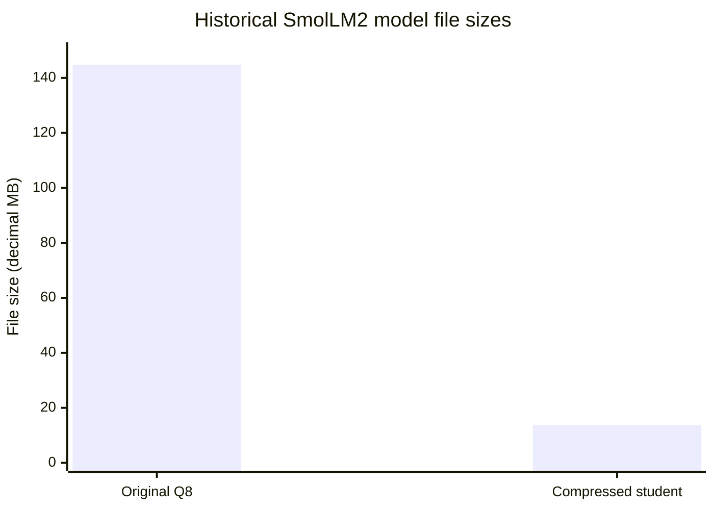
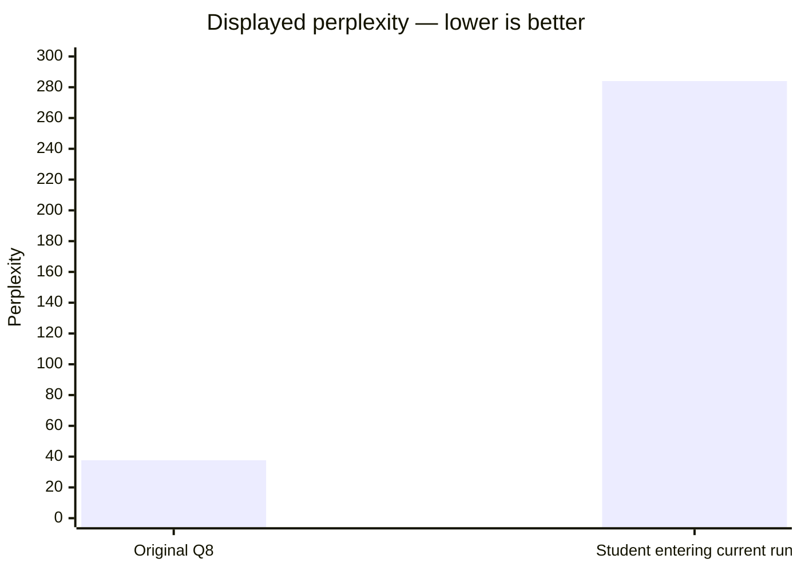
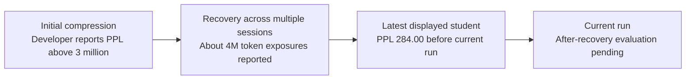

# NEXUS LittleBit Compression & Recovery

## Created with AI-assisted coding

**Rich Dunbar · NEXUS Emerging Technology · Build → Measure → Learn**

I created this program using **AI-assisted coding**, developing it through repeated build–measure–learn iterations. I directed the project and used AI to help implement, debug, review and refine the tools.

The project began as a **proof of concept for an independent, modified implementation inspired by LittleBit**, the ultra-low-bit compression research developed by researchers at **Samsung Research**. It combines my own implementation of the factor-compression approach with code and development work from my **Nexus web-based inference engine, Nexus Adapter tools and WebGPU backend**.

The aim is to explore how far a small language model can be compressed, then recover useful behavior through further training on local hardware.

> [!IMPORTANT]
> **This is an experimental NEXUS project, not the official Samsung LittleBit implementation.**
> Compression, successful inference and recovered language quality are separate milestones. Sub-1-bit storage does not mean that training uses sub-1-bit arithmetic or sub-1-bit VRAM per parameter.

## Recovery progress at a glance

| Milestone | Result | Evidence |
| --- | ---: | --- |
| Original Q8 model file | **144.81 MB** | Historical source file matched to the recovery report by SHA-256 |
| Saved compressed student file | **13.66 MB** | Saved model artifact, measured file size |
| File-size reduction | **90.56%** | Calculated from the two file sizes |
| Compression factor | **10.60× smaller** | Original bytes divided by compressed bytes |
| Initial post-compression perplexity | **Over 3 million** | Developer history; an earlier report records 3,857,725.91 |
| Latest displayed student perplexity | **284.00** | Supplied recovery screenshot |
| Original Q8 perplexity in that screenshot | **37.63** | Supplied recovery screenshot |
| Recovery training processed so far | **About 4 million token exposures** | Developer-reported progress |
| Hardware | **AMD Radeon RX 7900 XT** | Supplied hardware-monitor screenshot |
| Standalone recovery application | **Active recovery work; more advanced workflow** | Developer report; current after-recovery result remains pending |

The saved model-size evidence and the latest recovery screenshot are from different records. The screenshot does not identify its checkpoint hash, so the 13.66 MB file is a **documented historical compressed artifact**, not a verified identification of the latest 4-million-token checkpoint.

## Original size versus compressed size

| Artifact | Exact bytes | Decimal MB | Binary MiB |
| --- | ---: | ---: | ---: |
| Matching original SmolLM2 Q8 teacher | 144,811,360 | 144.811360 | 138.102875 |
| Saved compressed student | 13,664,928 | 13.664928 | 13.031891 |
| **Bytes saved** | **131,146,432** | **131.146432** | **125.070984** |



**Sub-1-bit, not sub-0.1-bit:** Using the model's nominal 135 million parameters, the saved student's complete file corresponds to approximately **0.81 bits per parameter**. This is a whole-file estimate, including container overhead. It is different from a selected matrix target or the **Q0.691** build label.

The reduction is **lossy model compression followed by recovery training**. It is not the separate NEXUS Zero Loss Compression project, and it does not preserve the original Q8 model's behavior automatically.

## Recovery evidence

### Current displayed comparison




The screenshot labels the student score **“Before recovery: 284.00”** and the current run's **“After recovery”** result **“Pending.”** I report that this student has already undergone earlier recovery work; 284 is its displayed starting score for this next run.

The panel states that automatic before/after evaluation uses the same held-out prefix, **up to 32,768 prediction positions out of 834,292 available**. A configured cap is not itself proof of how many positions a completed evaluation scored; retain the exported metric details.

### Progress across recovery sessions



This is a **development history**, not a matched benchmark curve. An older report used a Q8 baseline of approximately **88.22**, while the latest screenshot displays **37.63**. Corpus, evaluation protocol or other settings may differ; the records do not establish an identical evaluation across the entire history.

The screenshots support the displayed values. They do not independently prove the full training history, restored original-model quality or a particular percentage improvement in reasoning.

## Radeon GPU evidence and optimization


| Measurement | Visible snapshot |
| --- | ---: |
| GPU | AMD Radeon RX 7900 XT |
| GPU utilization | **62%** |
| GPU memory usage | **9,322 MB** |
| GPU temperature | **47°C** |
| Total board power | **70 W** |
| CPU utilization | **13%** |
| System memory usage | **14.7 GB of 32 GB** |

I have processed approximately **4 million training-token exposures** on my Radeon 7900 during the recovery work described here. I observe utilization commonly around **50–60%**, sometimes rising toward **90%**. The screenshot captures one moment at 62%; it is not an average over the complete run.

There is further optimization work to explore, including workload size, dispatch overhead and GPU scheduling. Utilization alone does not establish how much faster recovery can become. Improvements should be measured in **training tokens per second**, alongside memory use, numerical correctness and recovered-model quality.

The hardware monitor is a device-wide snapshot. It does not by itself attribute every allocation to this application or prove that every stage executes entirely on the GPU.

## Three recovery corpora and the Nexus OS goal

I have used AI to assist in creating three recovery corpora. They support different stages of the experiment and should not be confused with the original v11 bundled curriculum.

| Corpus | Purpose | Current description |
| --- | --- | --- |
| **1. Condensed general recovery** | Rebuild basic language behavior after aggressive compression | A lean, condensed corpus informed by the original SmolLM2 training sources; not a reproduction of its complete training data |
| **2. Nexus OS material** | Introduce the project's terminology, applications and operating-system context | Nexus-specific recovery material used in the ongoing development process |
| **3. Expanded knowledge corpus** | Broaden language and technical coverage | Approximately **26 million words**, according to my preparation estimate; intended as the next larger recovery corpus |

The expanded corpus covers **artificial intelligence, English language, emergence, coding, selected AI research areas, 2026 Python developments and information about the applications I have created for the Nexus OS bare-metal platform**.

I have sought to ground its technical material in academic and other authoritative references. AI-assisted preparation and source citations do not, by themselves, establish that every passage is correct or independently verified. Source records, dates, licenses, deduplication and held-out evaluation should accompany the corpus.

**Words are not tokens.** The 26-million-word estimate must not be treated as 26 million model tokens or as a completed training run. The approximately 4 million token exposures reported above are a separate measure and may include repeated material.

### Planned role inside Nexus OS

I have plans for a recovered SmolLM2 model inside **Nexus OS**. The intended sequence is:

1. Continue recovering usable base-model behavior.
2. Compare the recovered model with the original using matched evaluation.
3. Train the specialized Nexus OS adapter once base recovery is satisfactory.
4. Test integration with the custom kernel and its interfaces.

These are development goals. This README does not establish that the current student is ready for autonomous scheduling, kernel control or security-sensitive deployment.

## Original recovery workflow and standalone Recovery Studio

| Route | Role | Status |
| --- | --- | --- |
| **Original v1 integrated recovery** | Initial end-to-end proof of concept, including a custom SmolLM2-oriented corpus | I report that this workflow works; that is not a claim of restored original-model quality |
| **v11 package documented below** | Compression, inference and its packaged recovery implementation | Retained release-specific setup, formats and limitations |
| **Separate standalone recovery program** | More advanced recovery workflow added alongside the project | I report higher recovery throughput in my use; no matched tokens-per-second benchmark is supplied here |

The standalone program advances the recovery workflow, while the original program remains useful for understanding the initial proof of concept. **Training throughput and text-generation throughput are different measurements**; future comparisons should report which one was measured and use the same models, corpus and settings.

Do not assume a corpus or checkpoint format from one version can be imported into another without checking its documentation.

---

**An experimental WebGPU-based LLM compression, inference, and recovery toolkit**\
**Developer:** Rich Dunbar · NEXUS Emerging Technology · **Package:** v11, 8 October 2026 · **Progress update:** 10 October 2026

**Important**

**Research software, not a production-ready inference or training system.** NEXUS is an independent adaptation inspired by LittleBit research; it is not the official LittleBit implementation or a complete replacement for `llama.cpp`. Claims about recovered model quality and hardware performance require independent benchmarking.

## Overview

NEXUS explores aggressive quantization of local language models and the recovery of capabilities lost during compression. Its v11 browser workflow combines:

- **LittleBit-inspired factor compression** of GGUF model matrices, with default targets of **0.5 bits per weight (BPW)** for projections and **2 BPW** for embeddings and output heads. Actual storage also includes rank, scales, and other overhead.
- **Custom WebGPU inference** with GPU-resident projections, attention, and output scoring.
- **Five-stage recovery curriculum** totalling **10 million token exposures** (not 10 million distinct tokens).
- **Browser-native recovery**, with `.nqat` checkpoints and experimental recovered GGUF exports.
- **Optional Python/PyTorch workflow** for alternative compression and recovery operations.

**Supported browser recovery profile:** SmolLM2-135M, with a matching Q8_0 teacher and NEXUS-packed student. Other model presets or experimental sub-1-bit targets should not be interpreted as verified universal compatibility.

## Included model: NEXUS SmolLM2 Q0.691

**This repository includes an experimental compressed version of [SmolLM2-135M-Instruct](https://huggingface.co/HuggingFaceTB/SmolLM2-135M-Instruct), released here as NEXUS SmolLM2 Q0.691.** It is a **modified, ultra-low-bit student model derived from Hugging Face's original SmolLM2 weights**, not a newly pretrained model and not an official Hugging Face or Samsung release.

| **Item** | **Details** |
| --- | --- |
| Original model | [HuggingFaceTB/SmolLM2-135M-Instruct](https://huggingface.co/HuggingFaceTB/SmolLM2-135M-Instruct) |
| Original developer | **Hugging Face SmolLM team and contributors** |
| Included NEXUS derivative | **SmolLM2 Q0.691** — experimental LittleBit-inspired, low-bit compression |
| Recovery status | **Five-stage NEXUS recovery still required**; restored accuracy and instruction-following have not been independently demonstrated |
| Original model license | **Apache License 2.0**; retain applicable upstream attribution and notices |
| Original Q8_0 teacher | **Not included**; obtain and, if necessary, convert a compatible original checkpoint separately |

The **Q0.691** designation identifies this NEXUS experimental compressed build; it is **not a validated claim** of 0.691 effective bits per weight across every tensor, or of parity with Q4/Q8 or the original model. The included packed artifact may require the custom NEXUS factor-aware runtime and is **not directly compatible with unmodified `llama.cpp`**. Run the NEXUS recovery curriculum and compare it against a matching teacher before drawing quality conclusions.

**Credit and upstream links:**

- **Original SmolLM2 weights and model card:** [Hugging Face — SmolLM2-135M-Instruct](https://huggingface.co/HuggingFaceTB/SmolLM2-135M-Instruct)
- **Original source and training project:** [huggingface/smollm](https://github.com/huggingface/smollm)
- **Research paper:** Loubna Ben Allal et al. (2025), [*SmolLM2: When Smol Goes Big — Data-Centric Training of a Small Language Model*](https://arxiv.org/abs/2502.02737)
- **Upstream model license:** [Apache License, Version 2.0](https://www.apache.org/licenses/LICENSE-2.0)

NEXUS Emerging Technology is responsible for its compression, model-format adaptations, experimental recovery workflow and integration—not for the original SmolLM2 pretraining or instruction tuning. The upstream model's Apache 2.0 attribution and license obligations continue to apply to distributed modified weights.

## Quick start

1. **Extract the entire distribution ZIP.** Do not launch the HTML files from within the archive.
2. Enter the `NEXUS_LittleBit_Recovery_Studio/` folder. Keep `nexus_corpus_payload.js` next to both HTML files; the size-optimized release shares this payload.
3. Open **`Nexus_Web_LLM.html`** in a WebGPU-capable version of Edge or Chrome and check GPU initialization.
4. Find the **included NEXUS SmolLM2 Q0.691 compressed student model** among the repository model artifacts. It is an experimental compression output, **not a fully recovered or quality-validated model**.
5. For baseline testing and recovery, obtain a compatible **SmolLM2-135M-Instruct Q8_0 GGUF teacher** separately, starting from the [official Hugging Face model](https://huggingface.co/HuggingFaceTB/SmolLM2-135M-Instruct). The upstream repository does not necessarily provide the required Q8_0 GGUF directly.
6. **Optional:** To create a new student instead of using the included one, open **`NEXUS_LittleBit_Recovery_Studio.html`**, load the Q8_0 teacher, and export a packed factor GGUF.
7. Reopen or reload `Nexus_Web_LLM.html`, choose **Recovery** before loading a chat model, then select the **Q8 teacher** and the included or newly created **packed student**.
8. Start with conservative settings, save checkpoints frequently, and compare the original and recovered models using identical evaluation settings.

**Initial settings:** sequence length **32**, evaluation cap **1,024 tokens**, and application allocation ceiling **4,096 MiB**. These are starting points, not guaranteed hardware-fit limits. Driver and browser overhead are additional.

If your browser blocks local-file access, serve the extracted application folder over localhost:

```
cd NEXUS_LittleBit_Recovery_Studio
python3 -m http.server 8000 --bind 127.0.0.1
```

Then open `http://127.0.0.1:8000/Nexus_Web_LLM.html`. This command only serves local files; it **does not** start a Python training backend.

## Compression and recovery workflow

| **Stage**  | **Purpose**             | **Key details**                                                                                               |
| ---------- | ----------------------- | ------------------------------------------------------------------------------------------------------------- |
| Baseline   | Establish a reference   | Use the matching SmolLM2-135M-Instruct Q8_0 GGUF and record outputs.                                          |
| Compress (optional) | Pack a new factorized student | Skip this step when using the bundled Q0.691 student; otherwise the default targets are 0.5 BPW projections and 2 BPW embeddings/head. |
| Recover    | Train factor parameters | Uses the Q8 teacher, packed student, browser WebGPU backend, and a staged curriculum.                         |
| Checkpoint | Preserve work           | Use **Stop after update** and download a `.nqat`; checkpoints are **not** persisted automatically.            |
| Evaluate   | Compare before/after    | Keep prompts, evaluation settings, and baselines consistent. Export measurement reports.                      |

Recovery maintains FP32 masters, gradients, and optimizer state. **Training memory can be much larger than the packed model size.** For exact resumption, retain the original teacher and student files, settings, and matching `.nqat` checkpoint. Restarting another cycle retains learned factors but resets Adam. Python `.pt` checkpoints are **not interchangeable** with browser `.nqat` files.

The exported NEXUS factor GGUF is **not directly supported by stock `llama.cpp`**.

### Browser recovery model constraints

| **Parameter**       | **v11 recovery profile** |
| ------------------- | ------------------------ |
| Architecture        | SmolLM2-135M             |
| Layers              | 30                       |
| Hidden width        | 576                      |
| Query / KV heads    | 9 / 3                    |
| Head width          | 64                       |
| Vocabulary size     | 49,152                   |
| Teacher matrices    | Q8_0                     |
| Positional encoding | Unscaled RoPE            |

The separate adaptive inference companion has broader, but still limited, compatibility. Its presets are configuration suggestions, **not a claim that all listed models are supported**. It is not part of the v11 distribution.

## Recovery corpus: 10 million token exposures

| **Curriculum stage**     | **Budget** | **Source families**                                |
| ------------------------ | ---------- | -------------------------------------------------- |
| General language         | 2M         | DCLM-Edu / FineWeb-Edu                             |
| Structured text and code | 2M         | Cosmopedia V2 / Stack-Edu                          |
| Mathematics              | 2M         | FineMath / InfiMM-WebMath                          |
| Instruction tuning       | 2M         | Smol-SmolTalk                                      |
| Replay                   | 2M         | Reuse of the previous four stages                  |
| **Total**                | **10M**    | **8M selected source-token positions + 2M replay** |

A separate **32,768-token WikiText-2** validation stream is included. Budgets may reuse samples; they do not imply 10 million unique training tokens. The corpus manifest records relevant revisions and hashes. Near-duplicate contamination has not been independently audited, and underlying dataset licenses remain in force.

## WebGPU architecture

The browser uses **WebGPU** for GPU buffer management and **WGSL compute shaders** for model operations. Packed-factor projections use two matrix-vector passes instead of reconstructing an entire dense matrix. JavaScript coordinates model parsing, tokenizer selection, job scheduling, UI, and downloads.

- **Inference:** embeddings, projection layers, attention, and output scoring on the GPU where supported.
- **Compression:** WebGPU-accelerated randomized-SVD matrix products, with some QR/eigensolver and optional fitting work on CPU workers.
- **Recovery:** forward/backward computations and Adam updates for factor masters and scales; other dense tensors stay frozen in this workflow.

WebGPU may expose adapter limits, but does not reliably report total computer memory or free VRAM. Hardware compatibility, throughput and quality require testing on the specific browser, driver and GPU.

## Recorded validation versus current recovery progress

Historical validation in `VALIDATION.md` includes CPU logit/tokenizer comparisons, software-adapter shader tests and tiny-model gradient/optimizer checks. These support bounded implementation claims.

The newer developer-reported Radeon recovery work, current screenshots and historical size evidence are presented at the top of this README. The latest reported total is **approximately 4 million token exposures for the work described here**. The original curriculum's **10-million-exposure budget** is a configured target, not evidence that this current run has completed it.

The original v11 corpus and the three newer recovery corpora are separate records. Preserve their individual manifests, tokenizer settings, splits and source notices.

## Project files

The runtime files below are located inside `NEXUS_LittleBit_Recovery_Studio/` in the distribution ZIP. The included compressed model is a separate repository artifact; its exact filename and location must be checked against the published repository contents.

| **File**                                                              | **Role**                                                             |
| --------------------------------------------------------------------- | -------------------------------------------------------------------- |
| Included **NEXUS SmolLM2 Q0.691** model artifact                     | Compressed derivative of Hugging Face SmolLM2; recovery pending       |
| `Nexus_Web_LLM.html`                                                  | Browser inference UI and recovery controls                           |
| `NEXUS_LittleBit_Recovery_Studio.html`                                | Factor compression UI and corpus export                              |
| `nexus_corpus_payload.js`                                             | Shared recovery corpus payload in the under-25-MB distribution       |
| `smol_integration.js`                                                 | SmolLM2 tokenizer/ChatML and factor runtime integration              |
| `webgpu_backend.js`                                                   | GPU matrix-product acceleration for compression                      |
| `webgpu_autograd.js`                                                  | GPU tensors, gradients, and optimizer operations                     |
| `browser_recovery.js`                                                 | Teacher/student recovery, evaluation, `.nqat` and GGUF exports       |
| `build_bundle.py`                                                     | Rebuilds embedded runtime scripts/UI; source edits may need bundling |
| `local_ui.js`, `launch.py`                                            | Optional local Python interface                                      |
| `torch_compress.py`, `recovery.py`                                    | Optional PyTorch compression and recovery                            |
| `gguf_factors.py`                                                     | Factor GGUF packing and CPU helpers                                  |
| `corpus_builder.py`                                                   | Optional corpus selection and rebuilding                             |
| `compile_embedded_corpus.py`, `embed_corpus.py`, `embedded_corpus.py` | Corpus creation, embedding, extraction, and checks                   |
| `corpus/manifest.json`                                                | Corpus provenance and token-count metadata                           |
| `tests/`                                                              | Numerical fixtures and regression tests                              |
| `VALIDATION.md`                                                       | Historical verification and limitations                              |
| `PYTORCH_STUDIO_README.md`, `requirements.txt`                        | Optional Python setup and dependencies                               |
| `PACKAGE_NOTES_UNDER_25MB.md`                                         | Distribution-specific shared-payload instructions                    |

### Optional Python interface

Read `PYTORCH_STUDIO_README.md` and `requirements.txt` before installing dependencies. Install a supported PyTorch build separately. `python launch.py` runs the optional local application at `http://127.0.0.1:8765`. Older Python documentation may predate v11 browser recovery; the browser implementation is in the HTML application, `browser_recovery.js`, and `webgpu_autograd.js`.

## Research attribution and implementation differences

**SmolLM2:** The underlying pretrained and instruction-tuned model was developed by the **Hugging Face SmolLM team**, including Loubna Ben Allal, Anton Lozhkov, Elie Bakouch, Gabriel Martín Blázquez and their coauthors. See the [official SmolLM2-135M-Instruct model card](https://huggingface.co/HuggingFaceTB/SmolLM2-135M-Instruct), [upstream repository](https://github.com/huggingface/smollm) and [SmolLM2 paper](https://arxiv.org/abs/2502.02737). **NEXUS SmolLM2 Q0.691 is a modified compressed derivative, not an original NEXUS-trained foundation model.**

**LittleBit:** This independent NEXUS experiment is inspired by **Banseok Lee, Dongkyu Kim, Youngcheon You, and Youngmin Kim at Samsung Research**, *LittleBit: Ultra Low-Bit Quantization via Latent Factorization* (NeurIPS 2025). It adapts the underlying idea to a different Q8-teacher compression/recovery workflow, browser-native inference, a **NEXUS-designed** five-stage token curriculum, custom factor GGUF representations, and experimental WebGPU recovery. The five-stage curriculum is a NEXUS extension, **not a five-stage method prescribed by Samsung's paper**.

**References:** [Lee et al. — LittleBit (arXiv:2506.13771)](https://arxiv.org/abs/2506.13771) · [Official SamsungLabs implementation](https://github.com/SamsungLabs/LittleBit) · [Official repository license](https://github.com/SamsungLabs/LittleBit/blob/main/LICENSE)

Research credit belongs to the original authors. The official SamsungLabs LittleBit repository is separately licensed under **CC BY-NC 4.0**; this project's license does not supersede that or any third-party model and dataset terms.

## License and usage

- NEXUS-owned contributions are intended to be distributed under the **Apache License 2.0**, subject to the applicable license file and notices.
- This is **experimental software**. That status describes its readiness; it is **not an additional restriction** on the Apache license.
- **A compressed, modified SmolLM2 model artifact (NEXUS SmolLM2 Q0.691) is included in this repository.** The unmodified SmolLM2 model and the Q8_0 teacher required for baseline/recovery are **not included**; obtain them separately from the [official SmolLM2 source](https://huggingface.co/HuggingFaceTB/SmolLM2-135M-Instruct).
- **Original model copyright and license:** Hugging Face SmolLM team and contributors; [Apache License 2.0](https://www.apache.org/licenses/LICENSE-2.0). Preserve original attribution and applicable notices when redistributing the compressed derivative, and identify it as modified.
- Upstream code, model artifacts, and datasets may carry their own permissions and obligations.

**NEXUS Emerging Technology · Experimental research release · 2026**
